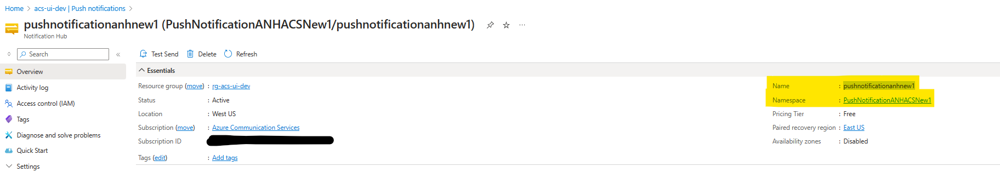
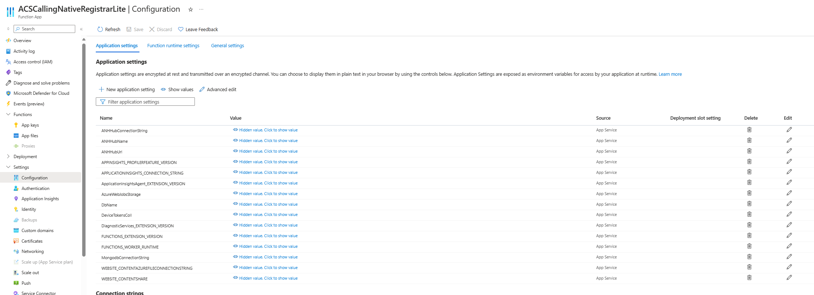
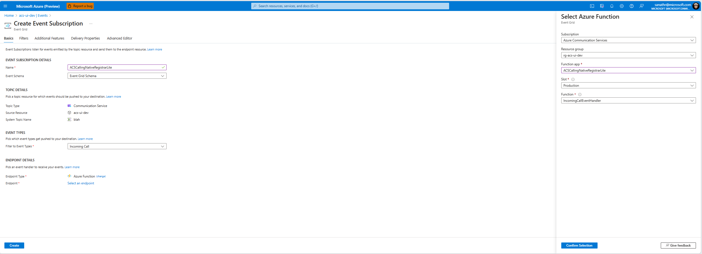

## Using Event Grid to deliver VOIP push to devices

### Prerequsites
In order to run this sample following things are required:

1. Azure account.
2. Azure Communication Services resource.
3. Azure Notification Hub configured.
4. MongoDb resource in Azure.
5. Azure Functions app resource (can also be deployed from Visual Studio).

### Steps

1. After creating a MongoDb resource in Azure. Create a database and a collection named `DeviceTokensColl` in MongoDb.
2. Deploy the above Azure function app to Azure. Ensure following variables are defined in function app's configuration settings.
    1. `DbName` : Name of the MongoDb DataBase.
    2. `MongoDbConnectionString` : MongoDb connection string.
    3. `ANHHubUrl` : ANH Hub Url. In this format `"https://{namespace}.servicebus.windows.net/{name}/messages/"` .
    4. `ANHHubConnectionString` : ANH Hub connection string.
    5. `ANHHubName` : ANH Hub name.
     
3. In the Azure Communication resource listen to IncomingCall event. 
4. Update the Native apps to send a POST request to the `add_device_token` function app API  and remove calling the registerPushNotifications API in the ACS SDK for e.g. Like in iOS `CallAgent.registerPushNotifications(deviceToken:)`.
